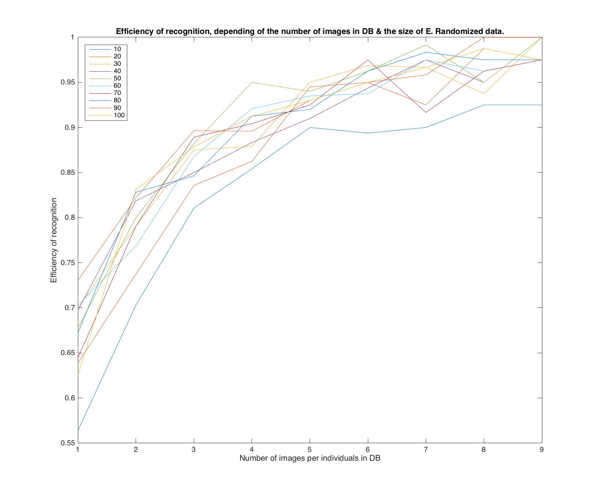

# Eigenfaces & face recognition with Matlab

Yet another Eigenfaces project using Matlab.

## About Eigenfaces

The Eigenfaces are used to compute similarities between images, and to recognize individuals automatically with given pictures, using a computer. The given pictures represent faces of individuals, and are useable as it is (no need to crop, etc.)

### Raw materials for this project

- Dataset: 40 individuals, 10 pictures per individuals. Images found in the website [http://www.cl.cam.ac.uk/](http://www.cl.cam.ac.uk/research/dtg/attarchive/facedatabase.html).
- Database: will contain some pictures & information about the guys we want to recognize. The DB will be initialised & created by a script, in a .csv format.
- Test scripts: when the database is filled with data about individuals, it could be interesting to test the results of algorithms...

### Going further...

If you want to learn more about Eigenfaces, I strongly encourage you to visit the website [http://scholarpedia.org/article/Eigenfaces](http://scholarpedia.org/article/Eigenfaces)

## How to use this project?

All the functions & usages are well documented in code. If you want to have a quick overview of functionalities:

### Getting started

- Clone this repos
- Take a look at "./att\_faces". This folder contains the images we will work with.
- Take a look at "./results". This folder contains results for previous executions.
- Take a look at "./data". This folder contains DB for a previous execution.

### Running scripts yourself

- Load script ./"tests.m". This script will load all the subscripts and run the algorithm, with the following parameters:
    + l.17: range of E's size you want to test

This script will display the overall accuracy for the execution (with random image selection and natural image selection to fill the database).

### Special use of scripts

You want to customize further the scripts?

- If you want to do the learning independently:
    + Load the function "./tests/do_learning.m"
    + `usage: [image_loaded] = do_learning(number_of_images,randomize,size_E)`
        * `randomize` is a boolean; it will create a database with randomly (or not) images. Note that a trace of loaded images is kept.
- If you want to test an image separately:
    + Load the function "./tests/test_learning.m"
    + `usage: [first_candidate_class] = test_learning(path,size_of_db)`
        * `path` is the path of the image you want to test.
        * `size_of_db` is the number of images which have been stored in the DB you want to use.

## Results & screenshots

Complete result datasets can be found in "./results" folder.

### Results of overall accuracy test, without randomly loaded images in DB.

### Results of overall accuracy test, with randomly loaded images in DB.

### Nearest neighbours for one individual 

